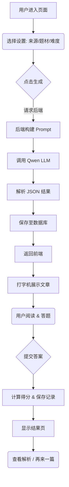

# AI 阅读理解功能实现文档

本文档详细说明了 LearnSphere AI 中 "阅读理解训练" 功能的实现流程，涵盖数据库设计、后端逻辑、AI 对接及前端交互。

## 1. 功能概述

该功能允许用户自定义阅读材料的来源、题材、难度和篇幅，利用 AI (通义千问) 实时生成高质量的英语阅读文章及配套的 comprehension questions（理解测试题）。用户作答后，系统自动评分并提供 AI 解析，同时记录学习轨迹。

---

## 2. 数据库设计

### 2.1 核心表：`reading_article`
用于存储 AI 生成的阅读文章及其题目，避免重复生成，并支持历史记录查询。

```sql
CREATE TABLE reading_article (
    id BIGINT AUTO_INCREMENT PRIMARY KEY,
    user_id BIGINT NOT NULL,
    title VARCHAR(255) NOT NULL,          -- 文章标题
    content TEXT NOT NULL,                -- 文章正文
    source VARCHAR(50),                   -- 来源 (e.g., economist)
    difficulty VARCHAR(20),               -- 难度 (easy, medium, hard)
    word_count INT,                       -- 词数统计
    questions JSON,                       -- 题目数据 (包含题干、选项、答案、解析)
    deleted TINYINT DEFAULT 0,
    create_time DATETIME DEFAULT CURRENT_TIMESTAMP,
    update_time DATETIME DEFAULT CURRENT_TIMESTAMP ON UPDATE CURRENT_TIMESTAMP
);
```

### 2.2 关联表：`learning_record`
用于记录用户的答题情况和得分。

*   `content_type`: 'reading'
*   `content_id`: 关联 `reading_article.id`
*   `original_content`: 冗余存储当时的题目和文章快照（用于回顾）

---

## 3. 后端实现 (Java / Spring Boot)

### 3.1 实体类 (`ReadingArticle.java`)
使用了 MyBatis-Plus 注解，其中 `questions` 字段使用 FastJson 的 `JacksonTypeHandler` 进行自动序列化/反序列化。

```java
@Data
@TableName(value = "reading_article", autoResultMap = true)
public class ReadingArticle {
    // ... 基本字段
    
    @TableField(typeHandler = JacksonTypeHandler.class)
    private List<Question> questions; // 内部类 Question 包含 text, options, correct, explanation
}
```

### 3.2 核心服务 (`AIGenerationServiceImpl.java`)

#### 关键步骤：
1.  **构建 Prompt**: 根据用户选择的参数（如 `category=tech`, `difficulty=hard`），构建结构化的 Prompt。
    > Prompt 示例: "请生成一篇关于科技前沿的雅思阅读文章，难度为精通，通过 JSON 格式返回，包含标题、正文、5道选择题..."

2.  **调用 LLM**: 使用 Alibaba DashScope SDK 调用通义千问模型 (`qwen-plus`)。

3.  **结果解析**: 将 AI 返回的 JSON 字符串解析为 `ReadingArticle` 对象。
    *   *容错处理*：如果 AI 返回的格式有误，尝试进行 JSON 修复或降级处理。

4.  **持久化**: 将生成的文章保存到 `reading_article` 表，方便“最近生成”记录的回显。

### 3.3 控制器 (`AIGenerationController.java`)
提供 REST API：
*   `POST /api/ai/reading/generate`: 触发生成，参数包含 `settings`。
*   `GET /api/ai/reading/history`: 获取用户的历史生成记录。

---

## 4. 前端实现 (Vue 3 + Naive UI)

前端组件：`src/views/ReadingView.vue`

### 4.1 页面状态管理 (`step`)
页面采用分步模式设计，改善用户体验：
1.  **Setup (设置)**: 用户选择来源、题材、难度。
2.  **Reading (阅读与答题)**: 显示文章和题目，进行沉浸式阅读。
3.  **Result (结果)**: 显示得分、正确率。
4.  **Review (回顾)**: 查看详细解析和答案比对。

### 4.2 核心交互特性

#### A. 打字机效果 (`useTypewriter.js`)
*   模拟 AI 实时生成的视觉反馈，让文章内容逐字显示，增加沉浸感。
*   支持点击立即跳过（`skipTyping`），方便快速阅读。

#### B. 侧边栏导航 (Sticky Sidebar)
*   **题目导航**: 左侧悬浮显示题目序号网格，支持快速跳转到特定题目。
*   **答题状态**: 通过颜色区分“当前题目”、“已答题目”和“未答题目”。
*   **进度条**: 实时显示答题进度百分比。

#### C. 响应式布局
*   **Desktop**: 双栏布局，左侧导航，右侧内容。
*   **Mobile**: 自动切换为单栏垂直布局，侧边栏置顶或折叠，字体和间距自适应调整。

### 4.3 样式设计
*   使用深色模式 (`rgba(30, 30, 35, 0.6)`) 配合毛玻璃效果。
*   配色方案采用 LearnSphere 标志性的渐变色（紫/绿/橙）区分不同板块。
*   定制化的 CSS 滚动条和交互动效（如 Ripple 波纹、Hover 浮起）。

---

## 5. 业务流程图



## 6. 后续优化方向
*   **长难句分析**: 在回顾阶段，由 AI 自动标注文章中的长难句并进行语法拆解。
*   **划词翻译**: 阅读过程中支持鼠标选词即时翻译。
*   **生词本联动**: 将文章中的生词一键添加到用户的生词本。
