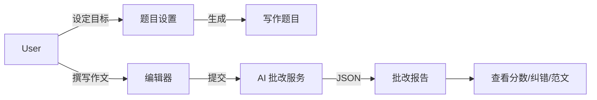

# 写作指导功能实现文档

## 1. 功能概述

写作指导模块提供从“题目生成”到“智能批改”的闭环训练。不仅支持雅思大作文/小作文、托福独立写作等应试题型，还支持邮件、文案等实用写作。AI 提供实时评分、语法纠错、逻辑优化建议及高分范文生成。

## 2. 数据库设计

### 核心表：`writing_topic`
存储写作题目。

```sql
CREATE TABLE writing_topic (
    id BIGINT AUTO_INCREMENT PRIMARY KEY,
    title VARCHAR(255),
    type VARCHAR(50),              -- ielts_task1, ielts_task2, email...
    requirements TEXT,             -- 具体要求/图表描述
    min_words INT,                 -- 字数要求
    difficulty VARCHAR(20),
    deleted TINYINT DEFAULT 0,
    create_time DATETIME DEFAULT CURRENT_TIMESTAMP
);
```

## 3. 后端实现

### 3.1 核心服务

1.  **题目生成**:
    *   针对不同题型（如雅思图表题）生成详细的文本描述或 ASCII 图表描述。
  
2.  **作文批改 (`evaluateWriting`)**:
    *   **Input**: 题目 + 用户作文。
    *   **Process**: 调用 LLM 进行深度批改。
    *   **Output**: 
        *   Score (0-9 或 0-30)
        *   Corrections (数组：原文 -> 修改后 -> 原因)
        *   Comments (整体评价：结构、论点、连贯性)
        *   Sample (针对该题目的高分范文)

## 4. 前端实现 (`WritingView.vue`)

### 4.1 界面布局
*   **左右分栏**: 左侧显示题目要求（始终可见），右侧为写作区域。
*   **富文本/纯文本编辑器**: 支持字数实时统计、拼写检查提示（浏览器原生）。

### 4.2 批改反馈 UI
*   **Diff视图**: 使用颜色高亮显示原文与修改后的差异（通过 `diff-match-patch` 算法或 AI 返回的精确位置）。
*   **点评卡片**: 结构化展示评分和分项评价。
*   **范文对比**: 允许用户一键查看并对比 AI 生成的满分范文。

## 5. 业务流程


