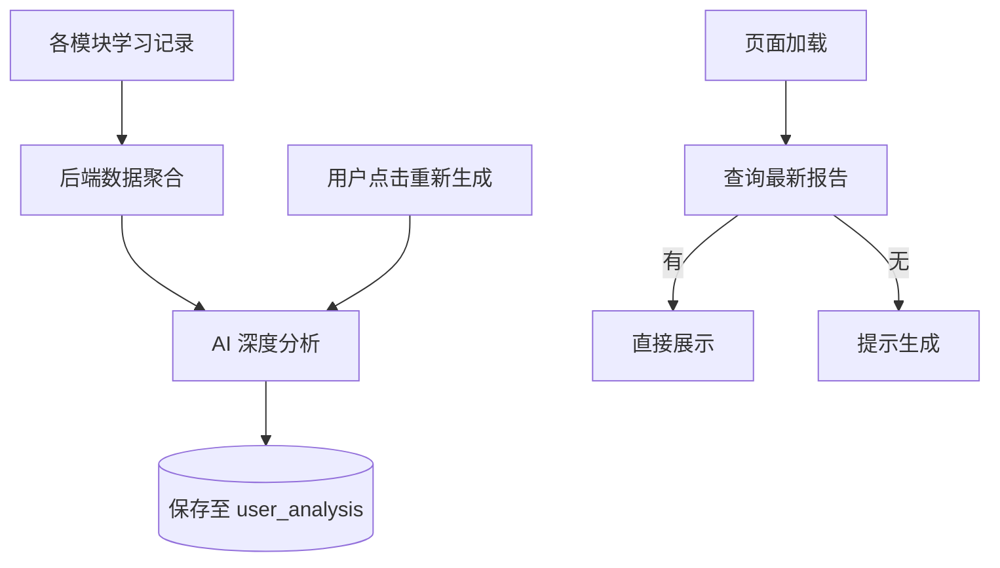

# 学习分析功能实现文档

## 1. 功能概述

学习分析模块是系统的“大脑”，它汇聚了用户在听、说、读、写各个板块的学习数据。通过 AI 对这些数据进行深度挖掘，生成可视化的能力雷达图、趋势曲线，并定期输出个性化的学习诊断报告和改进建议。

## 2. 数据库设计

### 2.1 用户分析表：`user_analysis`
持久化存储 AI 生成的分析报告，确保用户可以随时查看上次的评估结果。

```sql
CREATE TABLE user_analysis (
    id BIGINT AUTO_INCREMENT PRIMARY KEY,
    user_id BIGINT NOT NULL,
    report_json LONGTEXT,          -- 完整的分析报告 JSON 数据
    create_time DATETIME DEFAULT CURRENT_TIMESTAMP,
    update_time DATETIME DEFAULT CURRENT_TIMESTAMP ON UPDATE CURRENT_TIMESTAMP
);
```

> 报告 JSON 结构包含：综合评分、能力分布(雷达图数据)、薄弱点列表、AI 评语等。

## 3. 后端实现 (`AIGenerationServiceImpl.java`)

### 3.1 数据聚合 
`generateLearningAnalysis` 方法首先从 `learning_record` 表聚合统计数据：
*   **Open Rate**: 计算各板块正确率。
*   **Trend**: 查询最近 7/14 天的准确率变化。
*   **Weakness**: 识别得分率低于 60% 的具体的题型或标签。

### 3.2 AI 深度点评
将聚合的统计数据喂给 LLM (通义千问)，System Prompt 设定为“经验丰富的英语导师”。
*   **Input**: "阅读正确率 85%，但语法仅 40%，且过去一周学习时长呈下降趋势..."
*   **Output**: "你通过大量阅读保持了良好的语感，但语法基础薄弱限制了写作分数的提升。建议下周重点复习从句结构..."

### 3.3 持久化
生成的报告存入 `user_analysis` 表。接口 `getLastAnalysis` 优先读取数据库中的最新记录。

## 4. 前端实现 (`LearningAnalysisView.vue`)

### 4.1 可视化图表 (ECharts)
*   **能力雷达图**: 展示听、说、读、写、词汇、语法六维能力。
*   **趋势折线图**: 展示最近的学习状态曲线。

### 4.2 报告展示
*   **核心指标卡片**: 综合分、预测分、成长值。
*   **AI 导师寄语**: 专门的 UI 区域展示 AI 生成的温暖而专业的评语。
*   **薄弱项诊断**: 列表展示需改进的点及具体建议。

## 5. 业务流程


