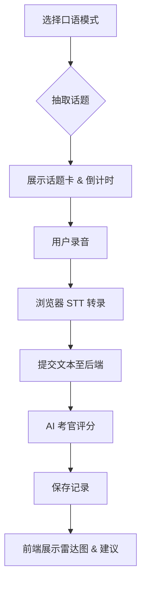

# 口语练习功能实现文档

## 1. 功能概述

口语练习模块模拟雅思/托福口语考试流程（Part 1/2/3）。系统随机生成口语话题卡（Topic Card），用户进行录音作答，AI 对录音转录文本进行多维度评分（流利度、语法、词汇、内容相关度）并提供改进建议。

## 2. 数据库设计

### 核心表：`speaking_topic`
存储口语话题库（可由 AI 生成或预设）。

```sql
CREATE TABLE speaking_topic (
    id BIGINT AUTO_INCREMENT PRIMARY KEY,
    type VARCHAR(50),              -- 类型 (ielts_part1, ielts_part2, daily)
    difficulty VARCHAR(20),
    title VARCHAR(255),
    question TEXT,                 -- 具体问题描述
    keywords JSON,                 -- 关键词提示
    tips JSON,                     -- 回答思路提示
    deleted TINYINT DEFAULT 0,
    create_time DATETIME DEFAULT CURRENT_TIMESTAMP,
    update_time DATETIME DEFAULT CURRENT_TIMESTAMP ON UPDATE CURRENT_TIMESTAMP
);
```

> 注：用户的录音评估记录存储在通用的 `learning_record` 表中，`original_content` 字段保存话题和 AI 评价详情。

## 3. 后端实现

### 3.1 核心服务 (`AIGenerationServiceImpl.java`)

1.  **话题生成 (`generateSpeaking`)**:
    *   AI 随机生成符合当前考试趋势的口语话题。
    *   返回包含 keywords 和 detailed description 的结构化数据。

2.  **口语评估 (`evaluateSpeaking`)**:
    *   输入：Topic (题目) + Transcription (用户回答的文本，由前端 STT 转换)。
    *   Prompt: "请作为雅思考官，从 Fluency, Vocabulary, Grammar, Pronunciation 四个维度对以下回答进行评分（0-9分）并给出具体修改建议。"

## 4. 前端实现 (`SpeakingView.vue`)

### 4.1 核心组件
*   **录音器 (Recorder UI)**: 
    *   利用 `Web Speech API (SpeechRecognition)` 实现实时语音转文字 (STT)。
    *   可视化动态波纹效果（CSS Animation）增加互动感。
    *   计时器： Part 2 模式下提供 2 分钟倒计时。

### 4.2 交互流程
1.  **话题抽取**: 用户选择模式，抽取话题卡。
2.  **准备阶段**: 1分钟思考时间（可选）。
3.  **录音阶段**: 实时显示语音转写的文本预览。
4.  **评估阶段**: 提交文本给后端，展示雷达图评分和详细建议。

## 5. 业务流程


