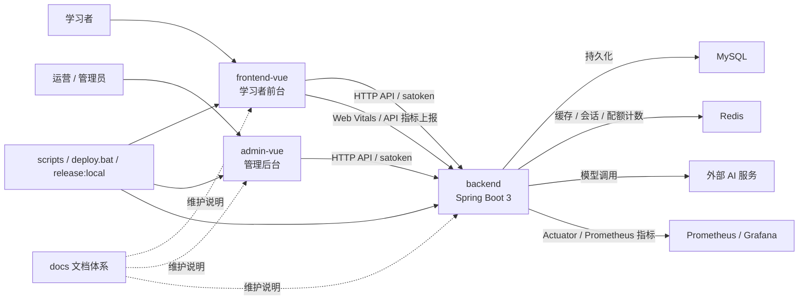

# LearnSphere AI 系统模块关系与关键链路

本文档用于回答两类高频问题：

1. 前台、后台、后端、MySQL、Redis、AI 服务之间到底怎么连。
2. 出现登录、学习记录、AI 调用、观测异常时，应该先从哪条链路排查。

如果你刚接手仓库，建议先看本页，再看 [项目总览与模块边界](./项目总览与模块边界.md) 和对应专题文档。

## 一、系统总图

## 二、模块职责与边界

| 模块 | 主要职责 | 代码入口 | 运维关注点 |
| --- | --- | --- | --- |
| `frontend-vue` | 学习者页面、练习流程、前端埋点、路由预加载 | `src/router/index.js`、`src/views/*`、`src/utils/request.js` | `VITE_API_URL`、静态资源构建、登录态跳转 |
| `admin-vue` | 运营后台、内容维护、AI 治理、日志与系统配置界面 | `src/router/index.js`、`src/views/*`、`src/api/admin.js` | `VITE_API_URL`、管理员 token、后台构建产物 |
| `backend` | 鉴权、业务 API、AI 调用、审计、指标暴露 | `src/main/java/com/learnsphere/controller`、`service`、`config` | `application*.yml`、数据库、Redis、AI 密钥、Actuator |
| `MySQL` | 用户、题库、学习记录、AI 日志、系统配置持久化 | 由 MyBatis Mapper / Service 访问 | 初始化顺序、迁移脚本执行顺序 |
| `Redis` | 登录态辅助、配额计数、缓存、临时状态 | `application*.yml`、业务 Service / Aspect | 连接地址、库号、过期策略 |
| `外部 AI 服务` | 提供生成、分析、AI 助教、A/B 实验底层能力 | `AIGenerationServiceImpl`、`AITutorServiceImpl` | 模型配置、超时、失败率、成本 |
| `Prometheus / Grafana` | 接收与展示后端 / 前端指标 | `Actuator`、`FrontendMetricsController` | 标签、抓取频率、告警路由 |

## 三、四条关键链路

### 1. 登录与鉴权链路

链路说明：

1. 学习者前台通过 `frontend-vue/src/views/LoginView.vue` 和 `frontend-vue/src/stores/user.js` 发起登录。
2. 管理后台通过 `admin-vue/src/views/Login.vue` 发起管理员登录。
3. 前后台请求封装分别在 `frontend-vue/src/utils/request.js`、`admin-vue/src/utils/request.js` 中把本地 token 写入 `satoken` 请求头。
4. 后端由 `AuthController`、`AdminAuthController` 负责登录签发，`SaTokenConfig` 负责全局拦截。
5. `StpInterfaceImpl`、`@SaCheckRole("admin")`、`RequireVip`、`VipCheckAspect` 继续决定角色和功能配额边界。

优先排查入口：

- 用户登录失败：先看 `AuthController` / `AdminAuthController` 和前端请求封装。
- 明明已登录但仍 401：先看本地 token key 是否正确，再看 `SaTokenConfig` 的拦截范围。
- 普通用户误进后台接口：先看 `/api/admin/**` 是否被 `checkRole("admin")` 覆盖。

### 2. 学习记录链路

链路说明：

1. 前台页面或组合式，如 `useGrammarPractice.js`、`useReadingPractice.js`、`useSpeakingPractice.js`、`useWritingPractice.js`、`stores/vocabulary.js`，调用 `frontend-vue/src/api/learning.js`。
2. `learningApi.createRecord / getRecords / getReviewList / getAnswerHistory` 对应后端 `LearningRecordController`。
3. 核心业务沉在 `LearningRecordServiceImpl`，实体为 `LearningRecord`。
4. 旧的答题历史聚合链路仍有 `LearningHistoryController` 与 `LearningHistoryServiceImpl`。
5. 管理后台通过 `admin-vue/src/views/Records.vue` 和 `AdminLearningContentController` 查看学习记录。

优先排查入口：

- 某个练习页答题后没落库：先看对应前台 composable 是否调用 `learningApi.createRecord`，再看 `LearningRecordController#createRecord`。
- 复习列表异常：先看 `getReviewList` 和 `LearningRecord.nextReviewTime` 的计算。
- 后台记录页和前台历史页数据不一致：先区分是否走了 `LearningRecordController` 还是旧的 `LearningHistoryController`。

### 3. AI 生成与 AI 治理链路

链路说明：

1. 学习者侧 AI 功能主要经由 `AIGenerationController`、`AITutorController` 进入后端。
2. 后台治理入口在 `admin-vue/src/views/AIGovernance.vue`，由 `useAIGovernanceShell.js` 组织多个页签。
3. 后台接口聚合在 `admin-vue/src/api/admin.js` 中的 `/admin/ai/*`、`/admin/ai-tutor/*`、`/admin/ai/feedback/*`。
4. 后端治理主入口分别是 `AdminAIController`、`AdminAITutorController`、`AdminAIFeedbackController`。
5. 核心执行与统计主要沉在 `AIGenerationServiceImpl`、`AITutorServiceImpl`、`AIGenerationLogServiceImpl`、`SystemPromptServiceImpl`、`AIExperimentServiceImpl`。
6. 相关持久化实体主要包括 `AIGenerationLog`、`SystemPrompt`、`SystemPromptHistory`、`AIExperiment`。

优先排查入口：

- Prompt 修改后不生效：先看 `SystemPromptServiceImpl` 是否写入成功，再看实际调用路径是否读取了对应 `promptKey`。
- AI 调用变慢或成本异常：先看 `AIGenerationLog`、后台 AI 日志页和 Prometheus / Grafana 看板。
- A/B 实验结果异常：先看 `AIExperimentServiceImpl` 的流量分配逻辑和实验状态。

### 4. 观测与告警链路

链路说明：

1. 前台在 `frontend-vue/src/utils/metricsReporter.js`、`request.js`、路由守卫中上报 Web Vitals、API 时延和路由切换指标。
2. 后端通过 `FrontendMetricsController` 接收前端指标。
3. 后端同时通过 `Actuator + Prometheus` 暴露系统指标。
4. 文档和模板资产在 `docs/性能优化/观测链路实施.md`、`prometheus-alert-rules.yml`、`Grafana看板草案.md`、`grafana-dashboard-template.json`。

优先排查入口：

- Grafana 面板空白：先看 Actuator 端点暴露、Prometheus 抓取标签和模板中的 `job/env`。
- 前端性能数据缺失：先看前台 `metricsReporter` 是否被拦截或被静默路由过滤。

## 四、配置与发布链路

### 1. 配置来源

| 类型 | 主要文件 | 说明 |
| --- | --- | --- |
| 前台环境变量 | `frontend-vue/.env.example` | 学习者前台 API 地址等构建变量 |
| 后台环境变量 | `admin-vue/.env.example` | 管理后台 API 地址等构建变量 |
| 后端基础配置 | `backend/src/main/resources/application.yml` | 通用配置和默认行为 |
| 后端生产覆盖 | `backend/src/main/resources/application-prod.yml` | 生产环境覆盖项 |
| 后端敏感模板 | `backend/src/main/resources/application-secret.properties.example` | 数据库、Redis、AI 等敏感项模板 |

### 2. 发布链路

推荐路径：

1. 根目录执行 `npm run build` 或 `npm run release:local`。
2. 前后台产物同步到 `backend/src/main/resources/static`。
3. 后端执行 `mvn clean package`。
4. 按 [本地测试到宝塔上线流程](../部署运维/本地测试到宝塔上线流程.md) 发布到 Linux 宝塔。

## 五、接手时的最短排查路径

| 问题类型 | 第一入口 | 第二入口 | 第三入口 |
| --- | --- | --- | --- |
| 登录 / 权限异常 | 前端 `request.js` / 路由守卫 | `AuthController` / `AdminAuthController` | `SaTokenConfig` / `StpInterfaceImpl` |
| 学习记录不对 | 前台对应页面或 composable | `frontend-vue/src/api/learning.js` | `LearningRecordController` / `LearningRecordServiceImpl` |
| AI 输出异常 | `AIGenerationController` / `AITutorController` | `AIGenerationServiceImpl` / `AITutorServiceImpl` | `AdminAIController` + AI 日志 |
| 后台治理页异常 | `admin-vue/src/views/AIGovernance.vue` | `admin-vue/src/api/admin.js` | `AdminAIController` / `AdminAITutorController` |
| 指标缺失 | `metricsReporter` / `FrontendMetricsController` | `Actuator` 暴露配置 | Prometheus / Grafana 模板 |

## 六、相关文档

- [项目总览与模块边界](./项目总览与模块边界.md)
- [关键模块维护地图](./关键模块维护地图.md)
- [数据库初始化与迁移约定](../数据库脚本/数据库初始化与迁移约定.md)
- [环境变量与启动说明](../部署运维/环境变量与启动说明.md)
- [观测链路实施](../性能优化/观测链路实施.md)
