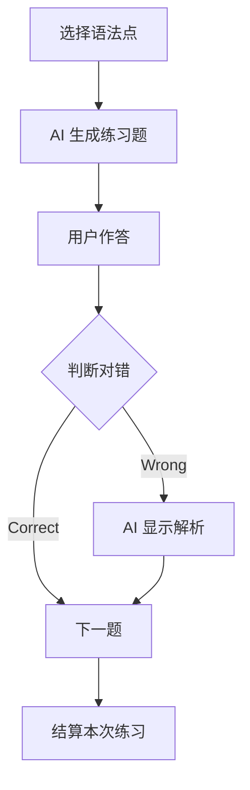

# 词汇与语法功能实现文档

## 1. 功能概述

词汇与语法是语言学习的基石。本模块包含两个子系统：
1.  **智能词汇本**: 基于艾宾浩斯遗忘曲线的背词系统，结合 AI 生成的场景例句和词义辨析。
2.  **语法专项训练**: 针对性生成改错题、填空题，并提供详尽的语法点解析。

## 2. 数据库设计

### 2.1 词汇表：`vocabulary` & `vocabulary_mastery`
*   `vocabulary`: 存储单词基础信息（拼写、音标、释义、例句）。
*   `vocabulary_mastery`: 存储用户对每个单词的掌握程度、上次复习时间、下次复习时间（用于间隔重复算法）。

### 2.2 语法题库表：`grammar_exercise`
```sql
CREATE TABLE grammar_exercise (
    id BIGINT AUTO_INCREMENT PRIMARY KEY,
    title VARCHAR(255),
    point VARCHAR(100),            -- 语法点 (e.g., Subjunctive Mood)
    difficulty VARCHAR(20),
    content JSON,                  -- 题目内容 (题干 + 选项)
    analysis TEXT,                 -- 答案解析
    deleted TINYINT DEFAULT 0,
    create_time DATETIME
);
```

## 3. 后端实现

### 3.1 词汇服务
*   **AI 详情生成 (`generateVocabularyDetails`)**: 当用户查询生词或导入单词时，AI 自动补全其词根词缀、固定搭配和场景例句。
*   **复习算法**: 根据 `vocabulary_mastery` 表计算每日需要复习的单词列表。

### 3.2 语法服务
*   **题目生成**: 根据选择的语法点（如通过 Prompt 指定 "生成5道关于虚拟语气的单选题"），AI 构造题目。
*   **错题分析**: 用户答错后，AI 提供针对该具体错误的个性化解释，而不仅仅是标准解析。

## 4. 前端实现

### 4.1 词汇界面 (`VocabularyView.vue`)
*   **抽认卡模式 (Flashcard)**: 正面单词，背面释义与例句。支持键盘快捷键（认识/不认识）。
*   **拼写测试**: 听音拼写模式。

### 4.2 语法界面 (`GrammarView.vue`)
*   **闯关模式**: 按语法点分类（时态、从句、非谓语），每一关由 AI 生成题目。
*   **即时反馈**: 选择选项后立即显示对错及解析，无需等到最后。

## 5. 业务流程 (语法训练)


