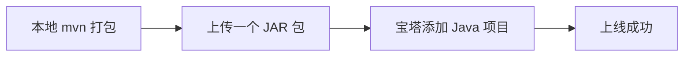

# LearnSphere AI 宝塔 Linux 部署文档 (全栈单体版)

本文档已针对您的环境（账号 `chen`、密码 `chen20040209`、AI Key 硬编码）进行了优化，采用 **全栈单体 JAR** 部署方案。前端已集成在后端包内，部署极其简单。

---

## 1. 核心流程图


## 2. 环境准备
在宝塔软件商店安装：
- **MySQL 8.0**: 数据库名 `learnsphere_ai`，用户 `chen`，密码 `chen20040209`。
- **Redis 6.0+**: 系统运行必需。
- **Java 项目管理器**: 安装 **JDK 17**。
- **Python 3 (可选)**: 仅当需要本地语音识别 (Whisper STT) 时安装，常规语音合成不需要。

## 3. 部署步骤 (仅需 3 步)

### 第一步：数据库初始化
1. 在宝塔面面板「数据库」中创建一个名为 `learnsphere_ai` 的库。
2. 设置权限：用户名 `chen`，密码 `chen20040209`。
3. **导入数据**：上传并导入项目根目录下的 `backend/learnsphere_ai_production.sql`。

### 第二步：后端打包与上传
1. **打包**：已经在本地完成前端构建并存入 `backend`。您只需在 `backend` 目录下执行：
   ```bash
   mvn clean package -DskipTests
   ```
2. **上传**：将生成的 `target/learnsphere-ai-backend-1.0.0.jar` 上传到服务器目录（如 `/www/wwwroot/learnsphere/`）。

### 第三步：宝塔添加项目
进入「Java项目管理器」->「添加项目」：
- **项目 Jar 路径**: 选择刚才上传的 Jar。
- **项目端口**: `8080`。
- **JVM 参数**:
  ```text
  -Xms256M -Xmx1024M -Dfile.encoding=UTF-8
  ```
- **程序参数**:
  ```text
  --spring.profiles.active=prod
  ```

---

## 4. 🎙️ 语音引擎详细配置 (轻量化/增强方案)

项目现已支持 **Java 原生 Edge TTS (Native)**，无需 Python 即可生成地道的单词朗读，音质极佳且极度省内存。

### 4.1 方案 A：轻量化部署 (推荐，节省 1GB+ 内存)
适用于 1G/2G 内存的云服务器。
1. **无需**上传 `edge_tts_server.py`。
2. **无需**安装任何 Python 环境或依赖。
3. **配置**：在宝塔 Java 项目「程序参数」中确保包含 `--voice-engine.enabled=false`（这是当前默认值）。
   *   **优势**：零额外内存占用，完全免费，点击朗读秒开。

### 4.2 方案 B：本地 Python 增强模式 (可选)
仅当您需要本地私有化部署语音引擎或使用 STT (语音转文本) 功能时使用。
1. **文件放置**：将 `edge_tts_server.py` 和 `requirements-voice.txt` 上传到 JAR 包同级目录。
2. **安装依赖**：
   ```bash
   cd /www/wwwroot/learnsphere
   pip3 install -r requirements-voice.txt
   ```
3. **开启配置**：在「程序参数」中设置 `--voice-engine.enabled=true`。

> 💡 **总结建议**：
> 如果您在宝塔上运行发现内存经常 100% 或项目自动停止，请务必使用 **方案 A**。

---

## 5. 访问路径说明
由于前端已集成，您现在可以通过后端地址直接访问：
- **用户端首页**: `http://服务器IP:8080/`
- **管理后台**: `http://服务器IP:8080/admin`
- **Swagger 文档**: `http://服务器IP:8080/doc.html`

## 6. (可选) Nginx 反向代理
为了使用域名访问（80/443 端口），请在宝塔「网站」中添加站点并配置反向代理：
- **代理名称**: `backend`
- **目标 URL**: `http://127.0.0.1:8080`
- **发送域名**: `$host`

## 7. 常见问题
- **数据库连不上**: 检查宝塔数据库权限是否允许 `127.0.0.1` 访问。
- **API 报错 403**: 检查 Redis 是否启动，系统依赖 Redis 进行 VIP 校验。
- **修改密码**: 如果未来想修改硬编码的密码，请修改 `application-prod.yml` 后重新打包。
