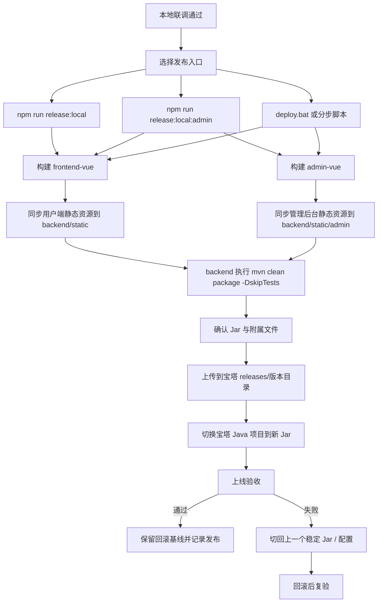

# 部署链路图与发布节点说明

本文档用于把当前项目的发布路径压缩成一张图和一套固定节点，重点回答三个问题：

1. 本地联调通过后，正式发版到底按什么顺序走。
2. 根目录命令、前端构建、静态资源同步、后端打包、宝塔切换分别处在哪个节点。
3. 哪个节点失败时该回到哪里处理，哪个节点失败时应该直接回滚。

默认场景：本地测试完成后，发布到 Linux 宝塔；不使用 Docker。

## 一、总链路图

## 二、节点说明

| 阶段 | 目标 | 主要命令 / 文件 | 完成标志 | 失败时回退点 |
| --- | --- | --- | --- | --- |
| 本地联调 | 确认功能可用、配置正确 | `npm run dev:frontend`、`npm run dev:admin`、后端本地启动 | 用户端、后台、关键接口可用 | 直接回到代码或配置修复 |
| 前端构建 | 生成前后台产物 | `npm run release:local`、`npm run release:local:admin`、`deploy.bat`、`scripts/构建前端应用.ps1` | `frontend-vue/dist`、`admin-vue/dist` 生成成功 | 回到前端依赖 / 构建配置 |
| 静态资源同步 | 将产物合入后端静态目录 | `scripts/同步静态资源.ps1` | `backend/src/main/resources/static` 更新完成 | 回到同步脚本或构建产物检查 |
| 后端打包 | 生成可发布 Jar | `mvn clean package -DskipTests`、`scripts/本地发版准备.ps1` | `backend/target/*.jar` 生成成功 | 回到 Java 构建或静态资源合包检查 |
| 上传宝塔 | 把产物放到服务器版本目录 | `releases/时间戳/`、`config/application-secret.properties` | 新版本目录文件完整 | 回到本地产物检查 |
| 切换运行版本 | 让宝塔加载新 Jar | 宝塔 Java 项目配置、`--spring.profiles.active=prod` | 服务可启动、端口正常监听 | 切回上一个稳定 Jar |
| 上线验收 | 确认用户可正常使用 | 首页、后台、登录、AI、Redis、日志检查 | 验收通过 | 直接进入回滚流程 |

## 三、推荐发布入口与适用场景

### 1. `npm run release:local`

适用场景：

- 本次只改学习者前台或后端
- 不涉及管理后台静态资源更新

会串起：

1. 构建 `frontend-vue`
2. 同步用户端静态资源
3. 打包 `backend`

### 2. `npm run release:local:admin`

适用场景：

- 本次同时改了管理后台
- 需要连同后台静态资源一起发版

会串起：

1. 构建 `frontend-vue`
2. 同步用户端静态资源
3. 构建 `admin-vue`
4. 同步管理后台静态资源
5. 打包 `backend`

### 3. `deploy.bat`

适用场景：

- 需要保留交互式确认
- 手头环境以 Windows 批处理为主

特点：

- 会询问是否同时构建后台
- 适合临时发版，但长期更推荐统一使用根目录 npm 命令

### 4. 分步脚本

适用场景：

- 需要单独定位某一段失败点
- 只想重跑构建或同步，不想整链路重复执行

常用入口：

- `scripts/构建前端应用.ps1`
- `scripts/同步静态资源.ps1`
- `backend` 目录下 `mvn clean package -DskipTests`

## 四、各节点输入与输出

### 1. 本地联调节点

输入：

- 最新代码
- 可用的 MySQL / Redis / AI 配置

输出：

- 明确这次是否涉及用户端、管理后台、后端、配置、数据库变更

### 2. 本地发版准备节点

输入：

- 已通过联调的代码
- 确认后的发布范围

输出：

- 最新前端构建产物
- 已同步到后端静态目录的资源
- 可上传的 Jar 包

### 3. 宝塔上传节点

输入：

- `backend/target/*.jar`
- `requirements-voice.txt`（如需语音能力）
- 外置配置文件（如采用外置配置）

输出：

- `releases/版本目录/` 下的新版本文件
- 本次发布记录

### 4. 切换与验收节点

输入：

- 新版本 Jar
- 对应配置文件
- 宝塔启动参数

输出：

- 新版本上线结果
- 是否保留回滚观察窗口的结论

## 五、最容易出问题的断点

| 断点 | 典型现象 | 优先检查 |
| --- | --- | --- |
| 前端构建失败 | Vite 报错、依赖冲突 | `package.json`、锁文件、前端构建日志 |
| 静态资源未同步 | 后端页面还是旧版本 | `scripts/同步静态资源.ps1` 是否执行、目标目录是否更新 |
| Jar 打包失败 | Maven 编译错误 | `backend` 代码、资源路径、Java 依赖 |
| 宝塔启动失败 | 进程拉不起来或日志报配置错 | `application-secret.properties`、环境变量、启动参数 |
| 上线后页面白屏 | 静态资源与后端版本不一致 | 本次是否漏同步 `static` / `static/admin` |
| AI 或 Redis 异常 | 页面可开但关键功能失败 | 外置配置、服务器网络、Redis / AI 连接信息 |

## 六、发布失败时的处理原则

### 1. 还没上传到服务器

结论：不要继续推进。

处理方式：

- 构建失败就留在本地修复
- 静态资源同步异常就先修脚本或目录
- Jar 没打出来就不要做宝塔切换

### 2. 已上传但还没切换运行版本

结论：风险还在可控范围内。

处理方式：

- 保留上传目录
- 不修改当前宝塔运行版本
- 修复后重新上传或覆盖本次版本目录

### 3. 已切到新版本且验收失败

结论：优先回滚，不建议在线硬扛。

处理方式：

1. 停止当前宝塔 Java 项目
2. 切回上一个稳定 Jar
3. 如本次改过配置，同时恢复上一个稳定配置
4. 重启旧版本
5. 重新验证首页、后台、登录和 AI 接口

## 七、最小发布清单

每次发版至少确认以下内容已经明确：

- 是否改了学习者前台
- 是否改了管理后台
- 是否改了后端接口
- 是否改了外置配置字段
- 是否改了数据库脚本
- 当前回滚基线版本是哪一个

## 八、相关文档

- [本地测试到宝塔上线流程.md](./本地测试到宝塔上线流程.md)
- [本地发版与宝塔上线检查清单.md](./本地发版与宝塔上线检查清单.md)
- [发布产物与回滚说明.md](./发布产物与回滚说明.md)
- [宝塔版本目录与发布记录模板.md](./宝塔版本目录与发布记录模板.md)
- [环境变量与启动说明.md](./环境变量与启动说明.md)

## 九、一句话结论

当前项目的稳定发布路径可以压缩成一句话：先在本地验证，再在本地完成构建与合包，然后把确认过的 Jar 和配置上传到宝塔，验收失败就直接切回上一个稳定版本。
