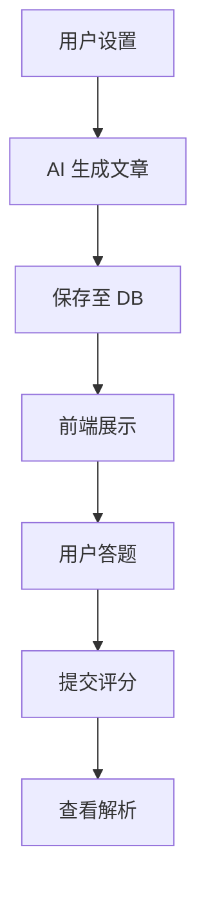

# 阅读理解功能实现文档

## 1. 功能概述

阅读理解训练功能允许用户自定义阅读材料的来源、题材、难度和篇幅。系统利用 AI (通义千问) 实时生成高质量的英语阅读文章及配套的 comprehension questions（理解测试题）。用户作答后，系统自动评分并提供 AI 解析。

## 2. 数据库设计

### 核心表：`reading_article`
用于存储 AI 生成的阅读文章及其题目，避免重复生成，并支持历史记录查询。

```sql
CREATE TABLE reading_article (
    id BIGINT AUTO_INCREMENT PRIMARY KEY,
    user_id BIGINT NOT NULL,
    title VARCHAR(255) NOT NULL,          -- 文章标题
    content TEXT NOT NULL,                -- 文章正文
    source VARCHAR(50),                   -- 来源 (e.g., economist)
    difficulty VARCHAR(20),               -- 难度 (easy, medium, hard)
    word_count INT,                       -- 词数统计
    questions JSON,                       -- 题目数据 (包含题干、选项、答案、解析)
    deleted TINYINT DEFAULT 0,
    create_time DATETIME DEFAULT CURRENT_TIMESTAMP,
    update_time DATETIME DEFAULT CURRENT_TIMESTAMP ON UPDATE CURRENT_TIMESTAMP
);
```

## 3. 后端实现

### 3.1 核心服务 (`AIGenerationServiceImpl.java`)

1.  **Prompt 构建**: 根据用户选择的参数（如 `category=tech`, `difficulty=hard`），构建结构化的 Prompt。
2.  **调用 LLM**: 使用 Alibaba DashScope SDK 调用通义千问模型。
3.  **结果解析**: 将 AI 返回的 JSON 字符串解析为 `ReadingArticle` 对象并存库。

## 4. 前端实现 (`ReadingView.vue`)

### 4.1 页面流程
1.  **Setup**: 用户选择来源、题材、难度。
2.  **Reading**: 显示文章（支持打字机特效）和题目。
3.  **Result**: 显示得分。
4.  **Review**: 查看详细解析。

### 4.2 核心交互
*   **打字机效果**: `useTypewriter` Hook 实现文章逐字输出。
*   **侧边栏导航**: 左侧悬浮题目网格，实时显示答题进度和专注度。

## 5. 业务流程


